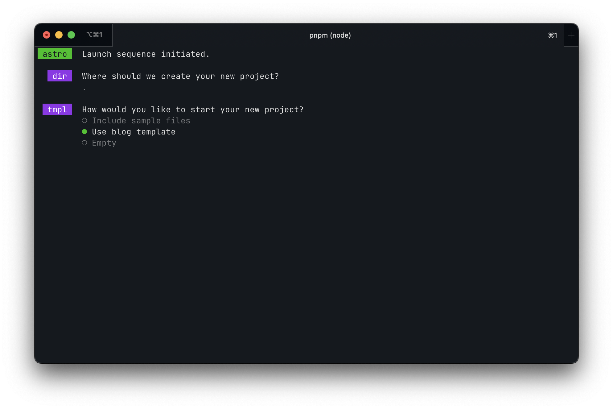
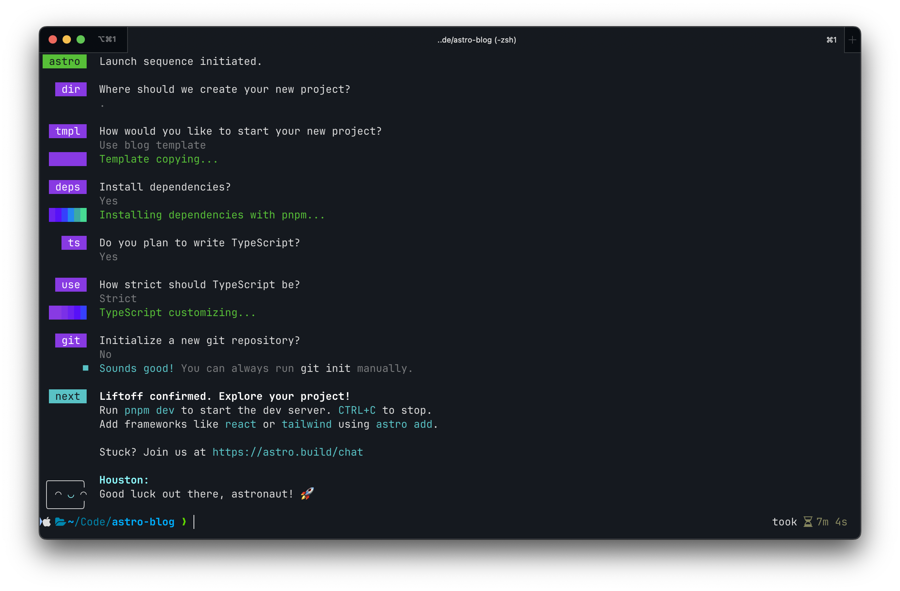

<hr />
Photo by <a href="https://unsplash.com/@joshhild?utm_content=creditCopyText&utm_medium=referral&utm_source=unsplash">Josh Hild</a> on <a href="https://unsplash.com/photos/brown-field-under-cloudy-sky-during-daytime-0fVKQbBqB9k?utm_content=creditCopyText&utm_medium=referral&utm_source=unsplash">Unsplash</a>

<hr />

## It's that time again, where I once again rebuild my personal website

But this time, there is also a new domain. Couple weeks (or a month) ago I had to chance to buy the domain of my last name with the Austrian TLD and I didn't wanted to let this chance slip away

This time, I'm also using *Astro* instead of Next.js. Astro makes it really easy to build a website with a blog, because it already has an easy way of rendering markdown content. To get started with Astro, you need Node.js to be installed (in my case with pnpm) and run the following command in the command line:

```bash
# create a new project with pnpm
pnpm create astro@latest
```

If you don't have **pnpm** installed, you can run the same command with `npm`.
The installation guide will even ask you if you want to use their blog template:


This is what the complete initialization process looked for me:


After that, you can open that directory in your favourite editor/IDE and start the server. After that, I've installed TailwindCSS (btw I love TailwindCSS and use it everywhere I can). Astro makes this pretty easy with the following command:

```bash
pnpm astro add tailwind
```

And the installer guides you through everything you need to setup TailwindCSS. And it gets configured for you too (love that DX).

After that, it is mostly styling your website and optimizing it for mobile, tablet and desktop view.

That's it for todays session, see you next time!
